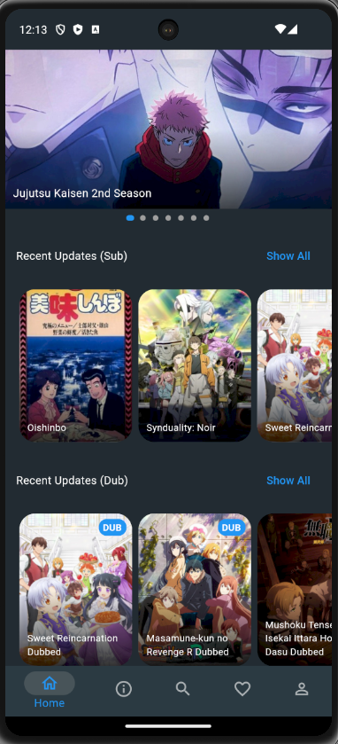
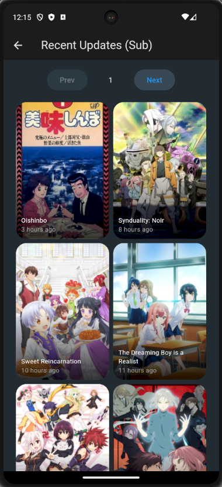
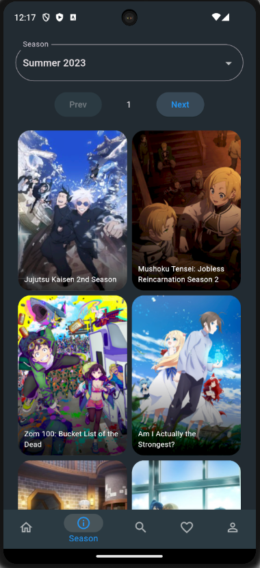
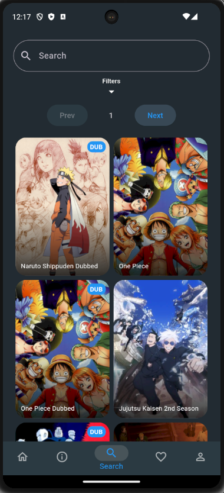
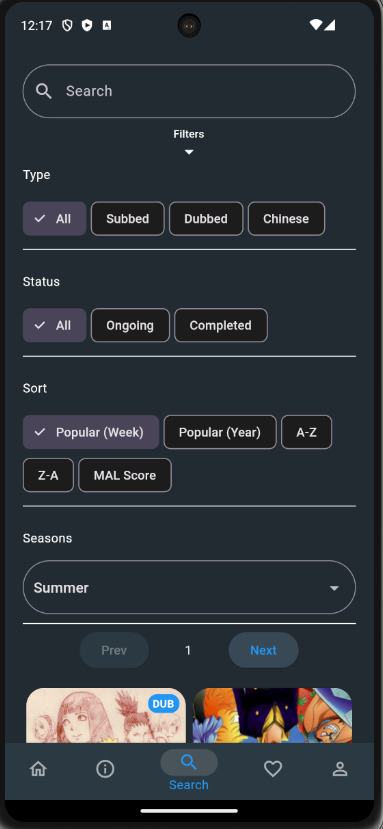
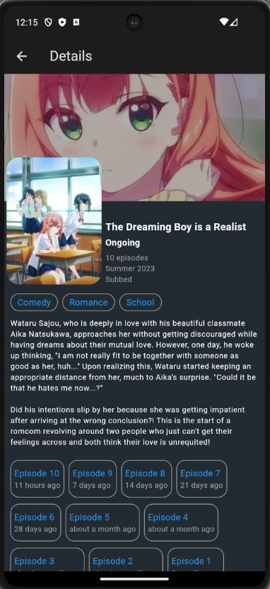
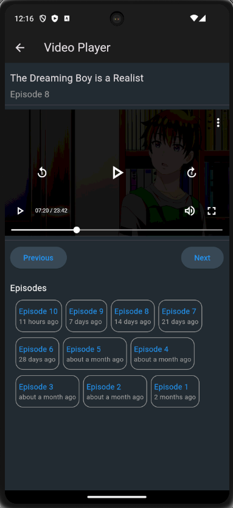

# AnKunv2 in Flutter

***This scrapes `https://animension.to` which at the time of writing this, it no longer exists/reachable.***

A clone of AnkunV2 with Flutter.

Updated from [AnKunv2](https://github.com/RadXGH/AnKunv2) that was built using Jetpack Compose. Also, removed some features to reduce performance impact.

## Requirements
- Minimum of Android SDK level 21

## Tech Stack
- Flutter 3.10.6
- Material App
- Flutter packages (check [pubspec.yaml](https://github.com/RadXGH/AnKunv2-flutter/blob/master/pubspec.yaml) for details): [http](https://pub.dev/packages/http), [html_unescape](https://pub.dev/packages/html_unescape), [carousel_slider](https://pub.dev/packages/carousel_slider), [dots_indicator](https://pub.dev/packages/dots_indicator), [better_player](https://pub.dev/packages/better_player), [timeago](https://pub.dev/packages/timeago)
- IntelliJ IDEA 2023.2 (Community Edition)
- Android Virtual Devices of Pixel 7 with API level 34

## App Preview
| Images                                                                                           | Behaviors                                                                                                                                                               |
|--------------------------------------------------------------------------------------------------|-------------------------------------------------------------------------------------------------------------------------------------------------------------------------|
|                      | <ul><li>Top thumbnail is a carousel which auto slides horizontally</li><li>Every section is a list which scrolls horizontally.</li></ul>                                |
|  | <ul><li>Each card item is clickable.</li><li>Shows the relative time of when each item is released.</li><li>List will be updated when a new item is released.</li></ul> |
|          | <ul><li>Season list will be updated when a new one is present.</li></ul>                                                                                                |
|                  | <ul><li>Search is available with both English and Japanese titles.</li><li>Search will use each word input.</li></ul>                                                   |
|  | <ul><li>Every filter change will update the item list.</li></ul>                                                                                                        |
|                | <ul><li>Episode list will be updated when a new one is released.</li><li>Each episode will have their relative release time.</li></ul>                                  |
|      | <ul><li>Currently only uses 1 source therefore the video might be unavailable.</li><li>Changing video quality causes video not to fill up the video screen.</li></ul>   |
